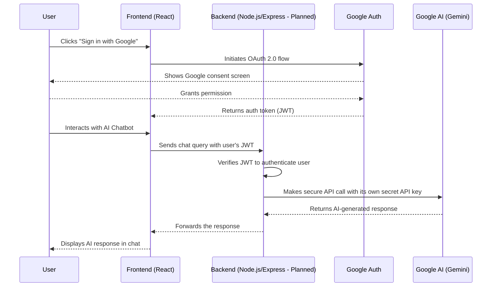

<h1 align="center">🏥 CareConnect</h1>
<h3 align="center">A Modern Healthcare Appointment Platform · Built with React, TypeScript & Tailwind CSS</h3>

<p align="center">
  <a href="https://care-connect-niroggyan.netlify.app/" target="_blank">
    
  </a>
  &nbsp;
  <a href="https://github.com/chiragSahani/CareConnect" target="_blank">
    
  </a>
</p>

<p align="center">
  
  
  
  
</p>

<p align="center">
  CareConnect is a next-generation healthcare platform designed to streamline medical appointment booking. Built with a modern frontend stack, it offers an intuitive, data-driven, and accessible user experience for patients and providers.
</p>


## 📋 Table of Contents

- [🚀 Key Features](#-key-features)
- [🛠️ Tech Stack & Architecture](#️-tech-stack--architecture)
- [🏁 Getting Started](#-getting-started)
- [🏗️ Project Structure](#️-project-structure)
- [🤖 AI-Powered Features (Powered by Gemini)](#-ai-powered-features-powered-by-gemini)
- [📈 Future Enhancements](#-future-enhancements)
- [🤝 Contributing](#-contributing)
- [📄 License](#-license)
- [🙏 Acknowledgments](#-acknowledgments)

---

## ✨ Key Features

-   **📅 Intuitive Appointment Booking:** Effortless, multi-step scheduling form with real-time availability checks and instant confirmation.
-   **🔍 Dynamic Doctor Directory:** Easily search, filter, and compare doctors by specialization, location, and user ratings.
-   **👨‍⚕️ Comprehensive Doctor Profiles:** View detailed profiles including credentials, schedules, patient reviews, and interactive performance charts.
-   **📊 Centralized Dashboard:** A personalized dashboard for users to track, manage, and visualize their upcoming and past appointments.
-   **📈 Data-Driven Insights:** Utilizes `Chart.js` and `Recharts` to visualize appointment statistics and doctor performance trends.
-   **📱 Fully Responsive Design:** A seamless experience across desktop, tablet, and mobile devices, built with a mobile-first approach.

---

## 🛠️ Tech Stack & Architecture

This project is built with a modern, scalable, and maintainable frontend architecture.

| Layer          | Technology                               | Rationale                                           |
| :------------- | :--------------------------------------- | :-------------------------------------------------- |
| **UI Framework** | React 18 + TypeScript                    | For building robust, type-safe, component-based UIs. |
| **Styling** | Tailwind CSS                             | A utility-first CSS framework for rapid UI development. |
| **Routing** | React Router v6                          | For declarative client-side routing.                |
| **State** | React Context API + Hooks                | For lightweight, centralized state management.        |
| **Forms** | React Hook Form + Yup                    | For performant, flexible, and scalable form validation. |
| **Animations** | Framer Motion                            | For creating beautiful and fluid user interactions.     |
| **Icons** | Lucide React                             | A simple and beautiful icon library.                |
| **Dates** | `date-fns`                               | For modern, reliable date/time manipulation.      |
| **Build Tool** | Vite                                     | For a blazing fast development and build experience.    |

### Architectural Overview

The application follows a component-based architecture where UI is separated into pages, layouts, and reusable components. Global state is managed via React Context to avoid prop-drilling.


## 🏁 Getting Started

Follow these steps to set up and run the project locally.

### Prerequisites

-   [Node.js](https://nodejs.org/en/) (v18.x or higher)
-   [npm](https://www.npmjs.com/) or [yarn](https://yarnpkg.com/)

### Installation & Setup

1.  **Clone the repository:**
    ```bash
    git clone https://github.com/chiragSahani/CareConnect.git
    cd CareConnect
    ```

2.  **Install dependencies:**
    ```bash
    npm install
    ```

3.  **Set up environment variables:**
    Create a `.env` file in the root of the project and add any necessary environment variables. For now, this is mainly for the planned AI integration.
    ```env
    # Example for planned Gemini API integration
    VITE_GEMINI_API_KEY="YOUR_API_KEY_HERE"
    ```

4.  **Start the development server:**
    ```bash
    npm run dev
    ```

5.  **Open your browser** and navigate to `http://localhost:5173`.

---

## 🏗️ Project Structure

```text
src/
├── assets/         # Static assets like images and SVGs
├── components/     # Reusable UI components
│   ├── common/     # Generic components (Button, Input, etc.)
│   ├── layout/     # Structural components (Header, Footer, Sidebar)
├── contexts/       # React Context providers for global state
├── data/           # Mock data, constants, and static content
├── hooks/          # Custom React hooks
├── pages/          # Top-level page components
├── types/          # TypeScript type definitions
├── utils/          # Utility functions
├── App.tsx         # Main application component with routing
├── main.tsx        # Entry point of the React application
└── index.css       # Global styles and Tailwind directives
````

---

## 🤖 AI-Powered Features (Powered by Gemini)

**Status:** 🚧 **Planned**

### Planned Features:

* **AI Chat Assistant:** Get 24/7 help with general health queries, platform navigation, and booking assistance.
* **Smart Summaries:** AI-generated summaries of doctor reviews and patient feedback.
* **Personalized Recommendations:** Suggestions for doctors based on user needs and historical data.

### Planned Authentication Flow for AI Features



### Implementation Status

* [x] UI designed for AI Chat and Google Sign-In.
* [ ] Backend endpoint for secure API calls to Gemini.
* [ ] User authentication (e.g., JWT-based) to protect endpoints.
* [ ] Real-time communication with WebSocket for the chat interface.

---

## 📈 Future Enhancements

* [ ] **Backend & Database**
* [ ] **User Authentication**
* [ ] **Real-Time Notifications**
* [ ] **Telemedicine**
* [ ] **Admin Dashboard**
* [ ] **Testing**
* [ ] **PWA Conversion**

---

## 🤝 Contributing

Contributions are welcome! Please:

1. Fork the repo
2. Create a branch (`git checkout -b feature/yourFeature`)
3. Commit and push your changes
4. Open a Pull Request

---

## ⭐ Show Your Support

If you find this project useful, star it on GitHub — it really helps!

---

## 📄 License

This project is licensed under the MIT License. See the LICENSE file for details.

---

## 🙏 Acknowledgments

* UI/UX Inspiration: Dribbble and modern healthcare platforms
* Icons: [Lucide](https://lucide.dev/), [Icons8](https://icons8.com)
* Images: [Pexels](https://www.pexels.com/)


<div align="center">
<b>CareConnect – Making healthcare accessible, one connection at a time.</b><br/>

</div>

